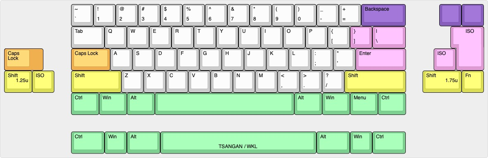
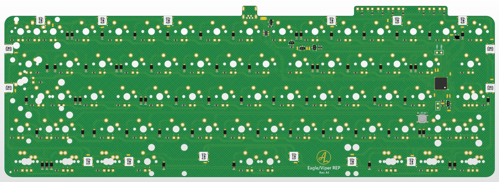

# Viper/Eagle REP

Replacement PCB for Viper/Eagle V2/V3

## Status:
Untested, initial prototypes ordered.

## Some features:
- QMK & VIA
- USB Mini
- STM32F072CB
- in-switich leds
- ISO and ANSI
- Underglow

## Layout support: 

## Altium view of PCB - Solder

## Revisions:
- Rev A1: Initial prototype