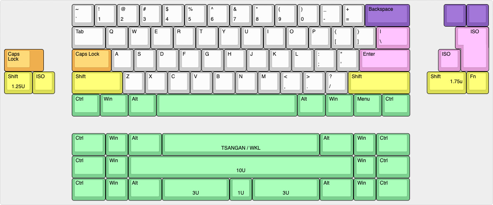
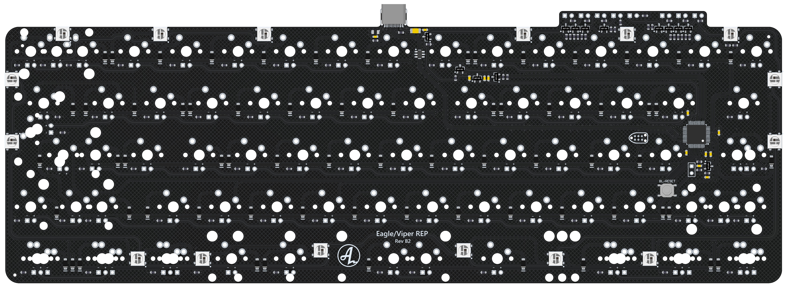

# Viper/Eagle REP

Replacement PCB for Viper/Eagle V2/V3

## Status:
Fully tested and implemented. QMK and VIA added to main branch.

## Some features:
- QMK & VIA main repos
- USB C
- APM32F072
- in-switich leds
- ISO and ANSI
- Underglow true to the original PCB

## Layout support: 

## Altium view of PCB - Solder

## Revisions:
- Rev A1: Initial prototype
- Rev B1: Changing to USB-C, adding split space, changing MCU and adding transistors for indicators
- Rev B2: Adjusting PCB outline around the USB-port for a slimmer fit. 

<a href='https://ko-fi.com/4pplet' target='_blank'>
